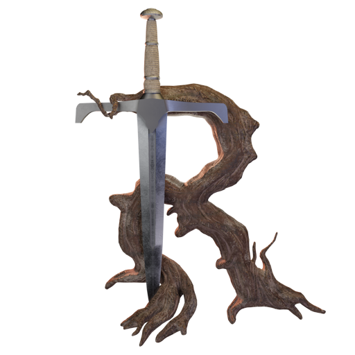

# Tides of Revival

Tides of Revival, or Tides for short, is, put as succinctly as possible, a Massive ImSim. Well, it isn't that _yet_. But that's the ambition.

  
  

**Here are some bullet points to describe the game:**

- Single-player RPG set in a huge fantasy world played from an FPS perspective.
- The world suffers millenia-long cycles, consisting of two so-called "tides": Chaos and Prosperity. You are starting the game just as the Chaos tide is winding down - people are beaten, the world is unknown, monsters are out there, but the chance to kickstart the way to Prosperity is now!
- "Offline" generated, prebaked world. Created once on our dev machines and then shipped as part of the game, just as though you'd downloaded a big AAA RPG.
  - This will allow us to create a world that is larger and more detailed and interconnected than any AAA studio could feasibly make.
  - You will play the same game, the same world, as everyone else, hopefully allowing for a community to spring up and find cool locations or ways to play the game.
- A focus on immersion and believability. We try to stay away from game design "plot holes", and known truths, and instead think through the game from first principles. We're willing to bet that players are ready for and desiring NPCs that are smart: beyond trivial state machines and ["must've been the wind"]("https://youtu.be/kX3OB4cYaa0?list=PLSMETuURtTXA0nxGMwg6WDA4rmjjscWT8").
- Dynamic dialogue and a world that changes with and without you.

For a more indepth discussion: https://www.youtube.com/watch?v=yoJ7ayDuaJQ

## Hills

To get Tides to what we want it to be, we work on it in terms of releases, called Hills. A hill is not just an improvement in terms of features and amount of content, as though we simply continued to churn on the game along some vector towards a goal in the far distance. It is also an opportunity for us to choose a specific, temporary direction, and a promise that we will create something solidified and game-like.

Towards the end of each hill we will allow ourself the time, energy, and fun, to polish it up into something that is a playable whole, even if it means some of it will get torn down again as we start working towards the next hill. One hill at a time! (But with some foresight).

On a technical level, we will also allow ourselves a bit of engineering slack and to build up some tech debt, when implementing new experimental, exploratory systems and features. By adding hacky code that's easy to tear down, we aren't needlessly spending time thinking of the perfect architecture before we know what the problem is. In between two hills, we can spend some time looking at existing debts and decide which ones are ripe for paying off.

For more on the concept of Hills: https://www.youtube.com/watch?v=BD_zbXHgI8E

### List of Hills

These are the currently planned hills. As you can see, it is quite a ways to go until we get anywhere close to our end goal. But hey, one step at a time!

| Hill Name                        | Status | Release | Description                                                                                                                      |
| -------------------------------- | ------ | ------- | -------------------------------------------------------------------------------------------------------------------------------- |
| Death from Darkness              | ✅     | 2023-01 | One brave person must light the way to a village on the other side of the valley. But make sure you stay in the light, or die... |
| March of the Ants                | ✅     | 2023-11 | Your farmstead is under attack by vicious ants. Use your bow to protect it for as long as possible.                              |
| A Fort Wasn't Built in a Day     | 🏃‍♀️     | 2024-08 | A nice place for a fort has been discovered. Protect it during the months it takes for the builders to finish constructing it.   |
| All Roads Lead to Various Places | ⏲️     | 2025-06 | Protect builders and caravans as they start traveling between villages. See the web of roads grow as you make the lands safer.   |
| The Revival Begins               | ⏲️     | 2026-02 | Bandits and wild creatures roam the lands. Only by you leading the Revival will villages start to grow and roads improve.        |

As you can see, the hill that we are currently working on is called **A Fort Wasn't Built in a Day**. Here are the planned technical additions we plan to make during course of its development:

- AI: Goals, actions, sensors
- Day/night cycle
- [Flecs](https://www.flecs.dev/flecs/) Explorer improvements
- [IMGUI](https://github.com/ocornut/imgui)
- [Jolt](https://jrouwe.github.io/JoltPhysics/) physics debug/viz
- Modular buildings along splines
- Pathfinding with [Recast and Detour](https://recastnav.com/)
- Render architecture
- Shadows (sun)
- Simple atmosphere model
- Terrain stitching
- [The Debuginator](https://github.com/Srekel/the-debuginator)
- [The-Forge](https://github.com/ConfettiFX/The-Forge) based renderer

## Follow the Development

- Discord: https://discord.gg/rzByav6Y7Z
- Youtube: https://www.youtube.com/@tides-of-revival
- Itch.io: https://tides-of-revival.itch.io/tides-of-revival
- Open World Gamedev Newsletter: https://open-world-gamedev-newsletter.vercel.app/
- Twitter: 
  - https://twitter.com/Srekel
  - https://twitter.com/gmodarelli
  - https://twitter.com/dryaddn
- Mastodon:
  - https://mastodon.gamedev.place/@srekel
  - https://mastodon.gamedev.place/@gmodarelli

Only the source is stored on Github. All content is stored on a private SVN for cost and licensing issues. Let us know if you want to try building and running the game and we can help you out!

All source is licensed as MIT or if you prefer, under the Unlicense. Dependencies (libraries) are listed in licenses.csv, those of course retain their individual license.